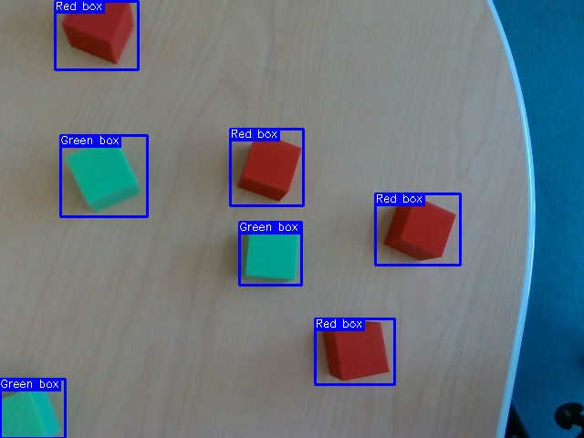

# Pick and Place System

A robotic pick and place system using XArm robot and Intel RealSense camera with computer vision object detection.

## Features

- Real-time object detection using Roboflow API
- Intel RealSense camera integration
- XArm robotic arm control
- Automatic object centering and picking
- Computer vision-based rotation detection

## Object Detection Example

The system uses computer vision to detect and classify objects with bounding boxes:



*Example showing detected red and green boxes with bounding boxes and classification labels*

## Requirements

- XArm robotic arm
- Intel RealSense camera
- Python 3.7+

## Installation

1. Clone this repository
2. Install dependencies:
```bash
pip install -r requirements.txt
```

## Usage

1. Ensure your XArm robot is connected and accessible at IP `192.168.1.210`
2. Connect your Intel RealSense camera
3. Run the main program:
```bash
python main.py
```

## Configuration

Update the following settings in `src/package_name/pick_and_place.py`:
- Robot IP address
- Roboflow API key
- Home, place, and safe positions
- Camera calibration parameters

## Project Structure

```
pick-and-place/
├── main.py                         # Entry point
├── requirements.txt                # Dependencies
├── README.md                      # Documentation
├── LICENSE                        # License
└── src/
    └── package_name/
        ├── __init__.py            # Package initialization
        ├── __about__.py           # Package metadata
        ├── camera.py              # RealSense camera interface
        └── pick_and_place.py      # Main pick and place logic
```

## Classes

### RealSenseCamera
- `get_frame()`: Capture image from camera
- `show_image(image)`: Display image
- `release()`: Stop camera

### PickAndPlace
- `run()`: Main execution loop
- `detect_objects()`: Object detection using Roboflow
- `center_object_in_frame()`: Center object in camera view
- `find_rotation()`: Calculate object rotation angle
- `convert_coordinates()`: Convert image to robot coordinates